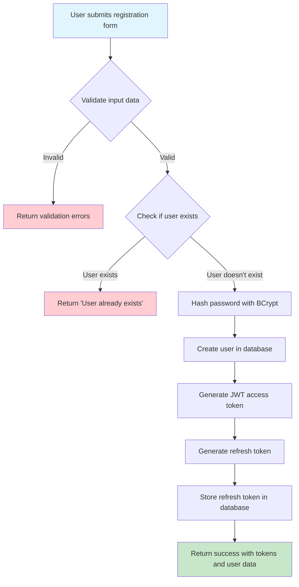
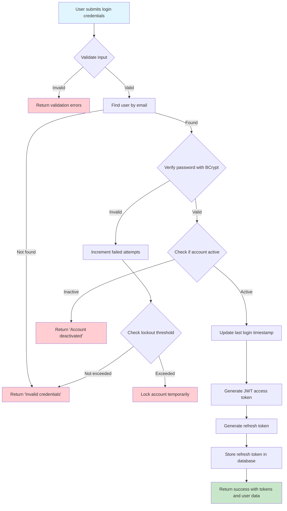
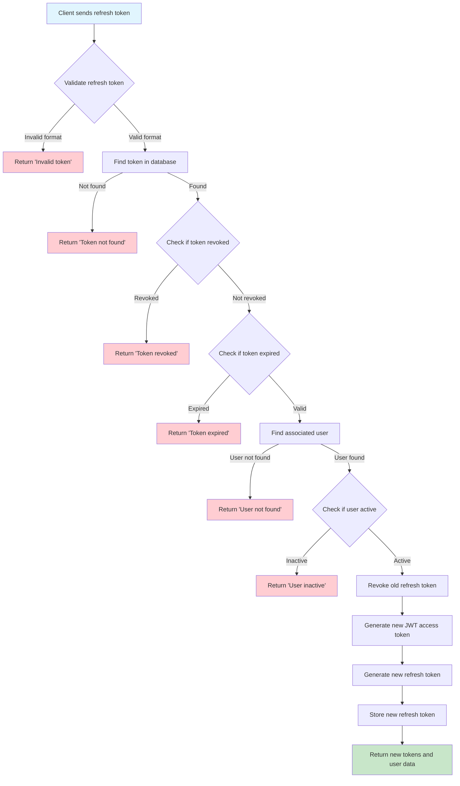
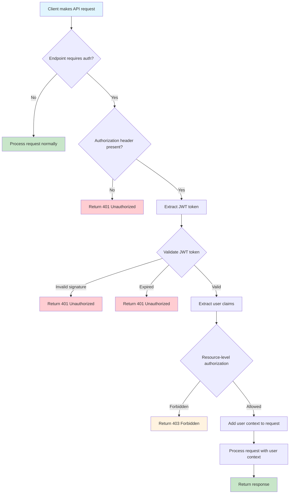
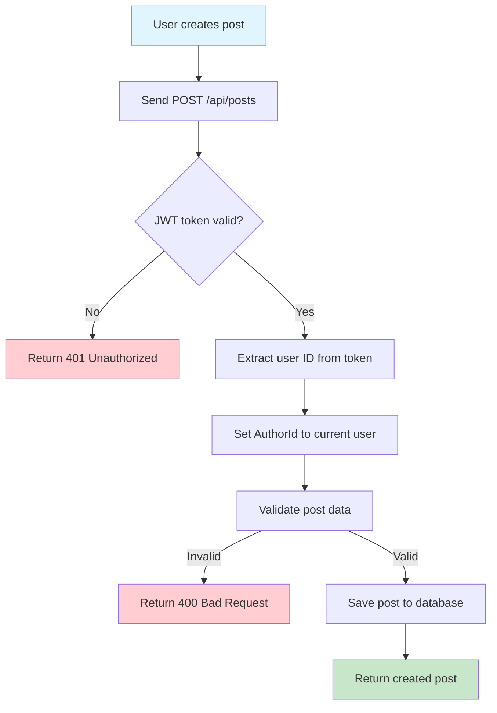
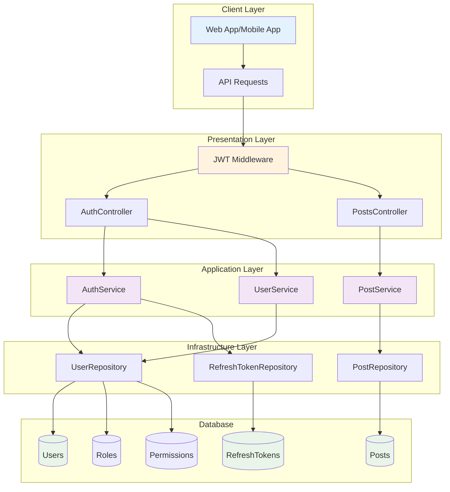
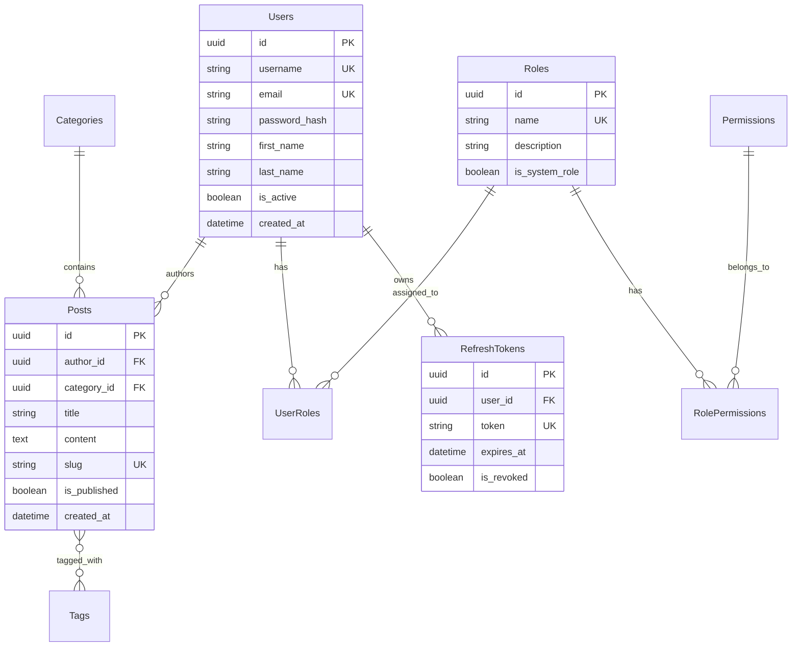
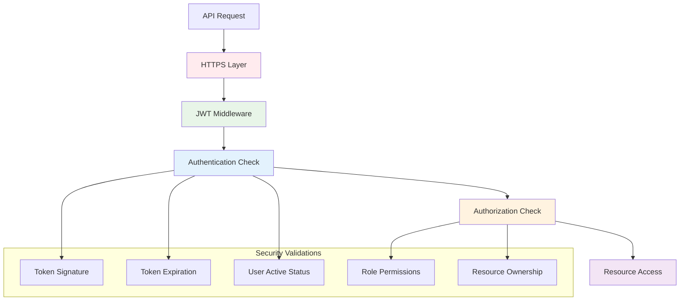
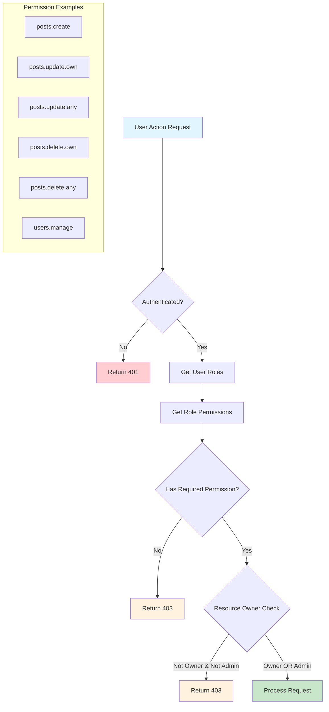

# Authentication & Authorization Workflow

This document provides visual workflows for the authentication and authorization system implemented in Phase 1.

## 🔐 User Registration Flow



## 🔑 User Login Flow



## 🔄 Token Refresh Flow



## 🛡️ API Request Authorization Flow



## 📝 Post Creation Flow (With Authentication)



## 🔧 Post Update Flow (With Ownership Check)

```mermaid
flowchart TD
    A[User updates post] --> B[Send PUT /api/posts/{id}]
    B --> C{JWT token valid?}
    C -->|No| D[Return 401 Unauthorized]
    C -->|Yes| E[Extract user ID from token]
    E --> F[Find post by ID]
    F -->|Not found| G[Return 404 Not Found]
    F -->|Found| H{User is author OR admin?}
    H -->|No| I[Return 403 Forbidden]
    H -->|Yes| J[Validate update data]
    J -->|Invalid| K[Return 400 Bad Request]
    J -->|Valid| L[Update post in database]
    L --> M[Return updated post]
    
    style A fill:#e1f5fe
    style M fill:#c8e6c9
    style D fill:#ffcdd2
    style G fill:#ffcdd2
    style I fill:#fff3e0
    style K fill:#ffcdd2
```

## 🔒 Complete Authentication Architecture Flow



## 🚀 JWT Token Structure

```mermaid
graph LR
    subgraph "JWT Token"
        A[Header] --> B[Payload] --> C[Signature]
    end
    
    subgraph "Header Content"
        D[{"alg": "HS256"<br/>"typ": "JWT"}]
    end
    
    subgraph "Payload Content"
        E[{"sub": "user-id"<br/>"email": "user@email.com"<br/>"name": "username"<br/>"roles": ["Author"]<br/>"exp": 1234567890<br/>"iss": "BlogAPI"<br/>"aud": "BlogAPI-Users"}]
    end
    
    subgraph "Signature"
        F[HMACSHA256(base64(header) + "." + base64(payload), secret)]
    end
    
    A --> D
    B --> E
    C --> F
```

## 📊 Database Relationships



## 🔐 Security Layers



## 🎯 Phase 2 Future Authorization Flow



---

## 🔧 Implementation Notes

### Current Phase 1 Status ✅
- **Authentication**: Fully implemented with JWT tokens
- **Basic Authorization**: Implemented for write operations
- **User Management**: Registration, login, token refresh
- **Security**: BCrypt password hashing, token validation

### Phase 2 Roadmap 🚧
- **Role-based Authorization**: Implement permission checks
- **Resource Ownership**: Detailed ownership validation
- **Admin Panel**: User and role management endpoints
- **Advanced Security**: Account lockout, audit logging

### API Endpoints Currently Available
- `POST /api/auth/register` - User registration
- `POST /api/auth/login` - User login
- `POST /api/auth/refresh` - Token refresh
- `POST /api/auth/revoke` - Token revocation
- `POST /api/auth/validate` - Token validation
- `GET /api/posts` - Public read access
- `POST /api/posts` - Authenticated write access
- `PUT /api/posts/{id}` - Authenticated update access
- `DELETE /api/posts/{id}` - Authenticated delete access